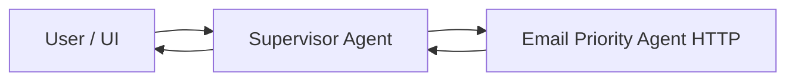
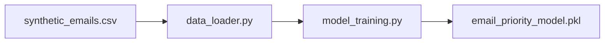
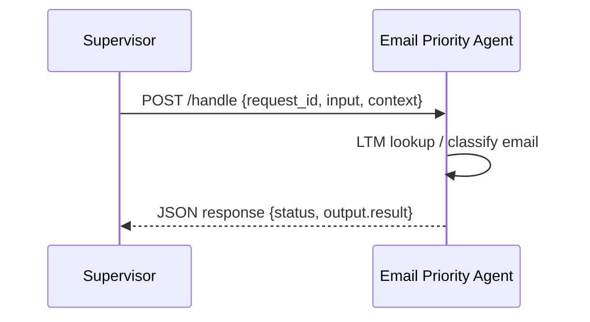
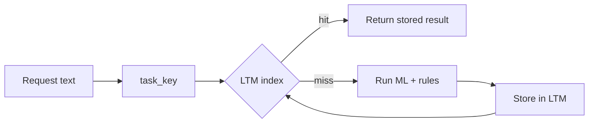
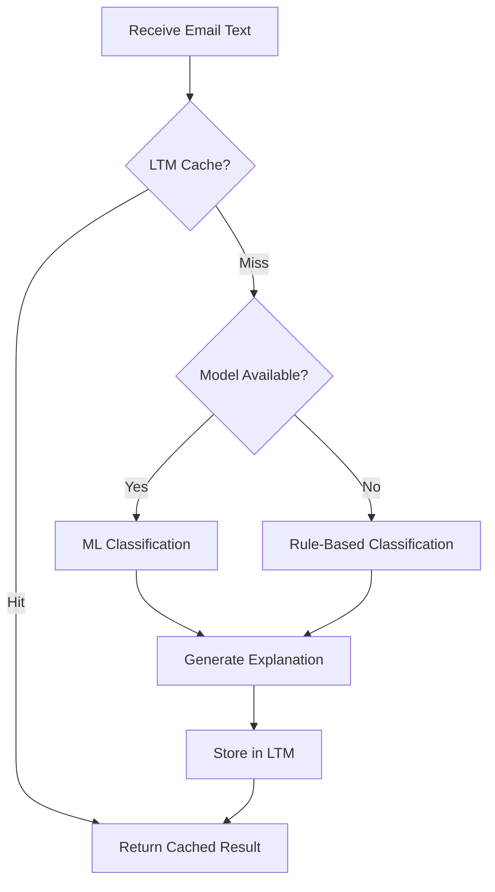

# Email Priority Worker Agent

> Worker agent for classifying emails into High / Medium / Low priority with explanations and long-term memory.

**Semester Project** – Fundamentals of Software Project Management – Fall 2025

**Quick Links:**
- `Live API` (Render URL: `/health`, `/handle`)
- `MAS Supervisor Repo` (link to your supervisor repository)
- `Docs` folder: [`docs/`](docs/)

---

## 1. Project Overview

### Problem Statement

- **Information Overload**: Too many emails make it difficult to identify important ones quickly
- **Manual Prioritization**: Manually sorting emails is time-consuming and error-prone
- **Multi-Agent System Integration**: Needs to fit into a MAS architecture where a Supervisor coordinates worker agents

### Objectives

- **Classify emails** into priority levels: `high`, `medium`, or `low`
- **Provide explanations** with detected keywords and classification method tag (`ML_MODEL` or `RULE_BASED`)
- **Implement Long-Term Memory (LTM)** as per MAS requirements for caching and learning
- **Expose HTTP/JSON API** compatible with Supervisor agent handshake contract

**Viva Note:**  
At viva, you'll likely get: "What is your agent's purpose?" / "What problem are you solving?" → This section is your ready-made answer.

---

## 2. System Architecture

### 2.1 MAS-Level Architecture

The Email Priority Agent operates as a **worker agent** in a multi-agent system:

- **Supervisor Agent**: Coordinates tasks, maintains Short-Term Memory (STM), routes requests to appropriate workers
- **Email Priority Agent**: Worker agent with Long-Term Memory (LTM), exposes HTTP service for email classification
- **Data Flow**: `User → Supervisor → Email Priority Agent → Supervisor → UI`



### 2.2 Internal Architecture

The Email Priority Agent is structured in three main layers:

- **API Layer** (`app.py`): Flask application with gunicorn for production, handles `/health` and `/handle` endpoints
- **Core Logic** (`email_agent/`): Priority classification, LTM store, handshake schemas, configuration
- **ML & Data** (`data/`, `scripts/`): Synthetic dataset, trained model persistence, training scripts

**Repository Structure:**

```text
SPM-Email-Priority-Agent/
├─ app.py                      # Flask HTTP entrypoint
├─ email_agent/                # Core package
│  ├─ config.py                # Configuration (paths, agent name)
│  ├─ data_loader.py           # Dataset loading utilities
│  ├─ priority_logic.py        # ML + rule-based classification
│  ├─ ltm_store.py             # Long-Term Memory implementation
│  ├─ handshake_schemas.py     # Pydantic models for API contract
│  ├─ models.py                # Priority enum, Email dataclass
│  ├─ learning/                # ML training pipeline
│  │  ├─ model_training.py     # Training logic (TF-IDF + LogisticRegression)
│  │  └─ model_store.py        # Model persistence
│  └─ utils/                   # Logging, evaluation utilities
├─ scripts/                    # Helper scripts
│  ├─ train_model.py           # CLI for training
│  └─ generate_synthetic_data.py
├─ tests/                      # Pytest test suite
├─ data/                       # Dataset and models
│  ├─ synthetic_emails.csv
│  └─ models/
│     └─ email_priority_model.pkl
├─ ltm/                        # Runtime LTM storage
│  ├─ ltm_index.json           # Task key → record file mapping
│  └─ records/                 # Stored classification results
├─ docs/                       # Documentation
├─ Dockerfile                  # Containerization
└─ requirements.txt            # Python dependencies
```

**Viva Note:**  
This section answers: "Explain your architecture", "What modules did you design?", "Where is LTM implemented?"

---

## 3. Tech Stack & Key Features

### Tech Stack

- **Python 3.11+** (3.13 used locally)
- **Flask 3.0+** for HTTP API
- **scikit-learn 1.4+** for ML classification (TF-IDF + LogisticRegression)
- **pandas, joblib** for data processing and model persistence
- **pydantic 2.0+** for request/response validation
- **pytest 8.0+** for testing
- **Docker + gunicorn** for containerization and production serving
- **Render** for cloud deployment

### Core Features

- **Hybrid Classification**: ML model (scikit-learn) with rule-based fallback
- **Long-Term Memory**: JSON-based LTM system for caching classification results
- **Detailed Explanations**: Includes detected keywords, confidence scores, and classification method tags
- **Healthcheck Endpoint**: `/health` for Supervisor agent discovery
- **JSON Handshake Contract**: Standardized request/response format with `request_id`, `agent_name`, `intent`, `input`, `context`

---

## 4. Setup & Local Development

### 4.1 Prerequisites

- **Python 3.11+** installed
- **Git** installed
- **(Optional) Docker** installed for containerized deployment

### 4.2 Clone the Repository

```bash
git clone https://github.com/<your-username>/SPM-Email-Priority-Agent.git
cd SPM-Email-Priority-Agent
```

### 4.3 Create and Activate Virtual Environment

**Windows PowerShell:**
```powershell
python -m venv .venv
.venv\Scripts\activate
```

**Linux/macOS:**
```bash
python3 -m venv .venv
source .venv/bin/activate
```

### 4.4 Install Dependencies

```bash
pip install --upgrade pip
pip install -r requirements.txt
```

### 4.5 Run the Application Locally

```bash
python app.py
```

The application will start on `http://127.0.0.1:5000` (development server).

**Available Endpoints:**
- `GET /health` - Healthcheck endpoint
- `POST /handle` - Main classification handler

**Viva Note:**  
This section answers: "How do you run your project?", "What is your development environment?", and demonstrates project management practices (venvs, requirements).

---

## 5. Synthetic Dataset & Model Training

### Dataset Overview

The agent uses `data/synthetic_emails.csv` with the following structure:
- **Columns**: `text` (email content), `priority` (high/medium/low labels)
- **Distribution**: Balanced synthetic dataset for training

### Training the Model

To train the ML model:

```bash
# From project root, with venv active
python scripts/train_model.py
```

**Expected Output:**
- Dataset loading confirmation
- Train/test split information
- Model accuracy and classification report
- Model saved to `data/models/email_priority_model.pkl`

**Training Pipeline:**


**Model Details:**
- **Feature Extraction**: TF-IDF vectorization (max_features=5000, ngram_range=(1,2))
- **Classifier**: Logistic Regression (max_iter=500)
- **Fallback**: If model is missing, agent uses rule-based keyword matching

**Viva Note:**  
Use this to answer: "How did you train your model?", "What data did you use?", "Why synthetic data?"

---

## 6. Testing

### Test Suite

The `tests/` directory contains:
- `test_priority_logic.py` - Tests for classification logic
- `test_ltm_store.py` - Tests for LTM storage and retrieval
- `test_handle_endpoint.py` - Integration tests for `/handle` endpoint
- `test_handshake_success.py` - Handshake contract validation
- `test_handshake_error.py` - Error handling tests

### Running Tests

```bash
# With venv active
pytest
```

**Expected Outcome:** All tests pass (note: Windows may have permission issues with `ltm/` directory on first run).

**Viva Note:**  
Questions like "How did you ensure quality?", "Do you have unit tests?" are answered here.

---

## 7. API Usage

### 7.1 Healthcheck Endpoint

```http
GET /health
```

**Response:**
```json
{
  "status": "ok",
  "agent": "email_priority_agent",
  "message": "Email Priority Agent is healthy."
}
```

### 7.2 `/handle` Endpoint

**Request Schema:**
- **Required**: `request_id`, `agent_name`, `intent`, `input.text`
- **Optional**: `input.metadata`, `context`

**Sample Request:**
```json
{
  "request_id": "demo-001",
  "agent_name": "email_priority_agent",
  "intent": "email.priority.classify",
  "input": {
    "text": "We have a critical production issue: the payment gateway is down and needs immediate attention.",
    "metadata": {
      "sender": "cto@example.com",
      "subject": "URGENT: Production outage",
      "received_at": "2025-11-30T10:00:00Z"
    }
  },
  "context": {
    "user_id": "demo-user-1",
    "conversation_id": "conv-1",
    "timestamp": "2025-11-30T10:00:05Z",
    "trace_id": "trace-1"
  }
}
```

**Sample Success Response:**
```json
{
  "request_id": "demo-001",
  "agent_name": "email_priority_agent",
  "status": "success",
  "output": {
    "result": {
      "priority": "high",
      "confidence": 0.79,
      "explanation": "Priority classified as HIGH using the trained model. Detected high-urgency words in the text: critical. [TAG: ML_MODEL] Confidence=0.79.",
      "raw_text_length": 95,
      "metadata_used": ["sender", "subject", "received_at"]
    }
  },
  "error": null
}
```

**Request Flow:**


**Viva Note:**  
This section answers: "Explain your API contract", "What does the Supervisor send and receive?"

---

## 8. Long-Term Memory (LTM)

### LTM Implementation

The agent implements LTM using a JSON-based file system:

- **`ltm/ltm_index.json`**: Maps `task_key` (hash of normalized input) → record filename
- **`ltm/records/*.json`**: Full stored classification results

### Workflow

1. **Lookup**: Check LTM index for existing `task_key`
2. **Cache Hit**: Return stored result immediately
3. **Cache Miss**: Run classification (ML or rule-based), then store result in LTM

**Example LTM Record:**
```json
{
  "task_key": "hash_of_normalized_text",
  "priority": "high",
  "confidence": 0.92,
  "explanation": "Priority classified as HIGH using the trained model. Detected high-urgency words in the text: critical. [TAG: ML_MODEL] Confidence=0.92.",
  "raw_text_length": 95,
  "metadata_used": ["sender", "subject"]
}
```

**LTM Flow Diagram:**


**Deployment Note:**  
On Render free tier, LTM persists per container lifetime but may reset on redeploy or after long idle periods.

**Viva Note:**  
This section answers: "How does your agent learn or remember things?", "How did you implement LTM?"

---

## 9. Deployment

### Docker

**Build:**
```bash
docker build -t email-priority-agent:latest .
```

**Run Locally:**
```bash
docker run -p 8000:8000 email-priority-agent:latest
```

The `Dockerfile` uses:
- Python 3.11-slim base image
- gunicorn for production serving (port 8000)
- All dependencies from `requirements.txt`

### Render Deployment

- **Service Type**: Web Service (Docker runtime)
- **Service URL**: `https://spm-email-priority-agent.onrender.com` (example)
- **Free Tier Constraints**: 
  - Spins down after ~15 minutes of inactivity
  - LTM is ephemeral (resets on redeploy)

**Viva Note:**  
Use this for: "How did you deploy your agent?", "Is it publicly accessible?", "What are the hosting constraints?"

---

## 10. Supervisor Integration

### Agent Registry Entry

The agent is registered in the Supervisor's agent registry:

```python
AgentMetadata(
    name="email_priority_agent",
    description="Classifies email-like text into priority levels (high/medium/low) and returns explanations.",
    intents=["email.priority.classify"],
    type="http",
    endpoint="https://spm-email-priority-agent.onrender.com/handle",
    healthcheck="https://spm-email-priority-agent.onrender.com/health",
    timeout_ms=8000,
)
```

**Integration Details:**
- Supervisor discovers the agent through this registry entry
- Uses `intent` + `name` to route tasks to the appropriate worker
- Healthcheck is called before sending real work to verify agent availability

**Viva Note:**  
This answers: "How does the Supervisor know about your worker?", "What did you change in the Supervisor code?"

---

## 11. Workflow Summary

### End-to-End Request Flow

1. **User Request** → Supervisor receives email classification request
2. **Supervisor Routing** → Supervisor checks agent registry, finds `email_priority_agent` for `email.priority.classify` intent
3. **Healthcheck** → Supervisor calls `/health` to verify agent is available
4. **Task Handoff** → Supervisor sends POST request to `/handle` with email text and metadata
5. **LTM Lookup** → Agent checks LTM for cached result based on `task_key`
6. **Classification** → If cache miss:
   - Load ML model (if available)
   - Run classification (ML or rule-based fallback)
   - Generate explanation with keywords and tags
7. **LTM Storage** → Store result in LTM for future requests
8. **Response** → Return JSON response with priority, confidence, explanation
9. **Supervisor Processing** → Supervisor receives response and forwards to UI
10. **User Display** → User sees prioritized email with explanation

### Classification Logic Flow



---

## 12. Viva Prep Cheat Sheet

### 12.1 Core Concepts

**MAS Roles:**
- **Supervisor**: Planner, coordinator, maintains STM, routes tasks to workers
- **Worker Agent**: Specialized task handler, maintains LTM, exposes HTTP service

**Memory Types:**
- **STM (Short-Term Memory)**: Maintained by Supervisor, temporary task state
- **LTM (Long-Term Memory)**: Maintained by Worker, persistent caching of results

**ML Concepts:**
- **Training**: Offline process using synthetic dataset (TF-IDF + LogisticRegression)
- **Inference**: Runtime classification using trained model or rule-based fallback
- **Train/Test Split**: 80/20 split for model evaluation
- **Why Simple Classifier**: Fast, interpretable, sufficient for email priority classification

### 12.2 Likely Questions & Answers

**Q: What is the main problem your agent solves?**  
A: Automatically ranking emails into high/medium/low priority with explanations to reduce information overload.

**Q: How does your agent learn?**  
A: Offline ML model trained on synthetic emails + LTM that caches successful responses and reuses them for similar future requests.

**Q: What happens if the model file is missing?**  
A: The agent falls back to rule-based logic using urgency keywords and metadata; still returns an explanation marked `[TAG: RULE_BASED]`.

**Q: How does LTM work technically?**  
A: We hash normalized input text into a `task_key`, store results as JSON under `ltm/records/`, and maintain an `ltm_index.json` mapping keys to records.

**Q: How do you ensure your API is robust?**  
A: We validate handshake fields using Pydantic, always return structured JSON with `status` and exactly one of `output` or `error` non-null, and expose `/health` for availability checks.

**Q: What is the difference between ML_MODEL and RULE_BASED tags?**  
A: `[TAG: ML_MODEL]` indicates classification used the trained scikit-learn model; `[TAG: RULE_BASED]` indicates keyword-based heuristics were used (fallback or when model unavailable).

### 12.3 Demo Script Checklist

- [ ] Show `/health` endpoint response
- [ ] Show `/handle` with high-priority email (urgent keywords)
- [ ] Show `/handle` with low-priority email (casual content)
- [ ] Show repeated request to demonstrate LTM caching
- [ ] Show error handling (invalid request format)

---

## Additional Resources

- **API Contract Details**: See `docs/api_contract.md`
- **Design Overview**: See `docs/design_overview.md`
- **Memory Strategy**: See `docs/memory_strategy.md`
- **Supervisor Integration**: See `docs/integration_with_supervisor.md`

---

**Last Updated**: 2025-11-30

